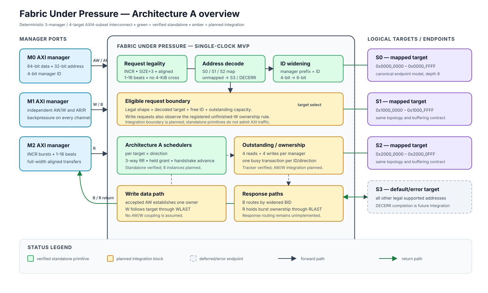

# Architecture-A overview

This block diagram follows the system-level layout of the referenced hardware architecture figure: manager interfaces on the left, the interconnect boundary in the center, and logical targets/endpoints on the right. Green blocks are individually verified standalone primitives. Amber blocks are specified integration work. Dashed paths indicate planned integration boundaries.

The diagram is an original project visual and does not copy technical architecture from the reference figure. It reflects the frozen Fabric Under Pressure topology and current evidence state.
